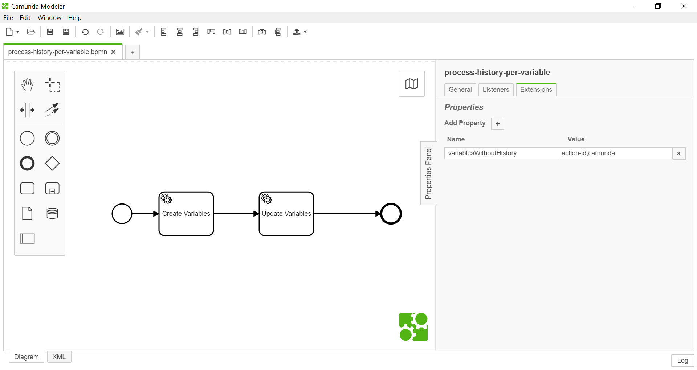

# Camunda: Custom Variable History Level

This example demonstrates how to register a custom history level by implementing a process engine plugin.

This examples adds one history level:

The `bpm-per-variable` history level behaves like the normal full history except that only variables which are not blacklisted in the `variablesWithoutHistory` property are saved to history. This way you can meet data protection requirements.

Adapted from https://github.com/camunda/camunda-bpm-examples/tree/master/process-engine-plugin/custom-history-level


## Activate the Custom History Level Engine Plugin

The custom history level engine plugin can be activated in the `camunda.cfg.xml`:

``` xml
<!-- activate bpmn parse listener as process engine plugin -->
<property name="processEnginePlugins">
  <list>
    <bean class="de.cryxy.bpm.camunda.plugin.history.BpmCustomHistoryLevelProcessEnginePlugin" />
  </list>
</property>
```

## Configure Custom History Level

To enable the custom history configure it also in the `camunda.cfg.xml`:

```xml
<property name="history" value="bpm-per-variable" />
```

## Create a process

```xml
<bpmn2:extensionElements>
  <camunda:properties>
    <camunda:property name="variablesWithoutHistory" value="action-id,camunda" />
  </camunda:properties>
</bpmn2:extensionElements>
```



The variables "action-id" and "camunda" are not saved to history.


## How to use it?

1. Checkout the project with Git
2. Import the project into your IDE
3. Inspect the sources and run the unit test.
